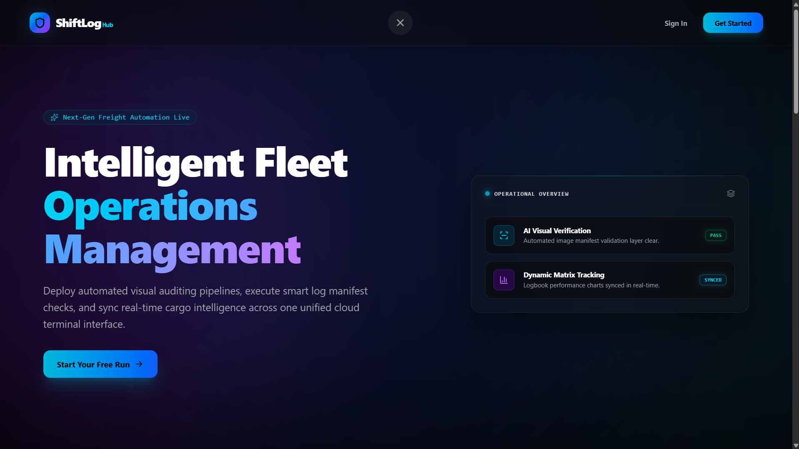
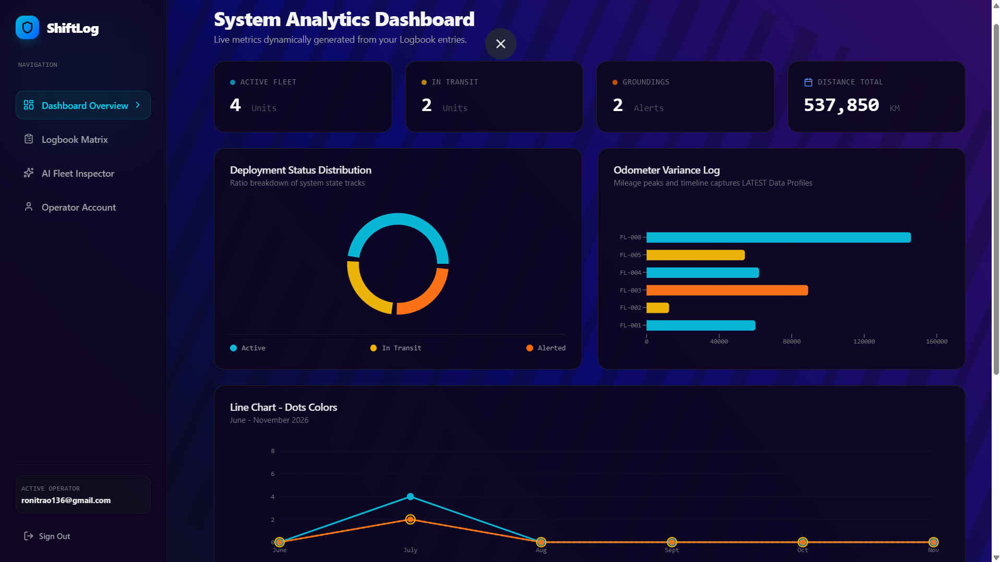
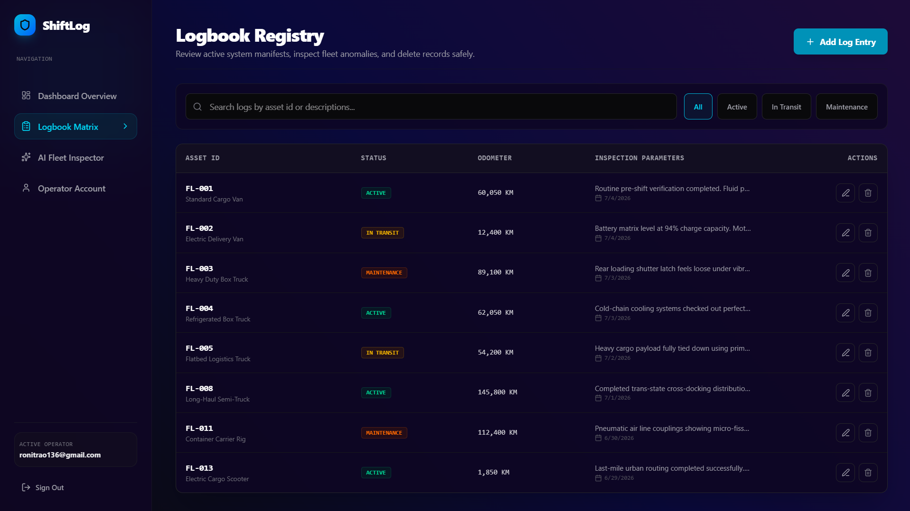
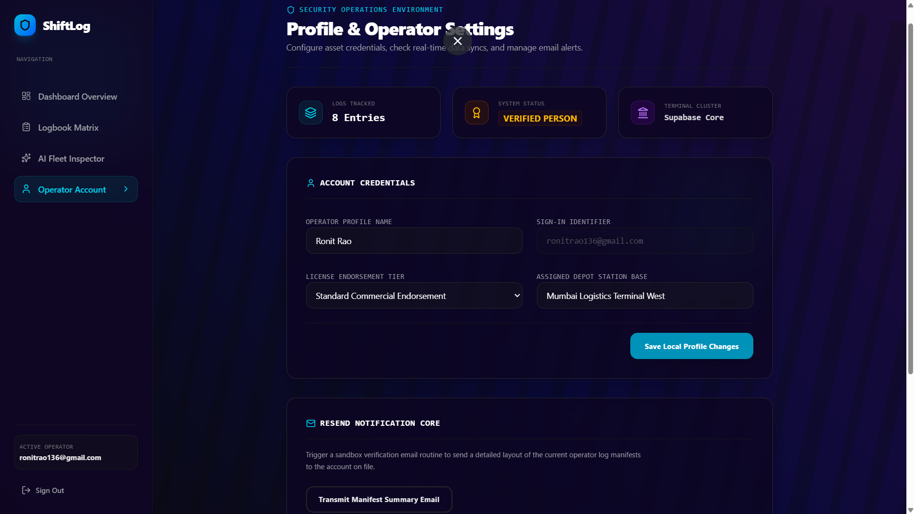

# 🛡️ ShiftLog Hub

> **Next-Gen Intelligent Fleet Operations Management Platform**
> A high-fidelity, production-grade application engineered for mission-critical freight distribution pipelines, automated visual log auditing, and seamless cloud telemetries.

---

## 🚀 Executive Overview

**ShiftLog Hub** streamlines transport compliance by replacing fragmented driver sheets and manual backlogs with automated visual verification and serverless data coordination. Built with an elite glass-morphic UI, absolute type safety, and rigid backend data isolation, it sets a new standard for modern freight management ecosystems.

---

## 🎨 Visual Interface & System Layouts

### 🖥️ Immersive Entry Platform
The system utilizes a slow-sweeping kinetic background mesh mixed with premium frosted glass navigation headers and seamless text glow gradients.


### 📊 System Analytics Console
Features real-time diagnostic distribution metrics, odometer variance charts, and line-haul productivity tracking mapped across high-fidelity data visualization grids.


### 📋 Logbook Registry
A clean log registry overview implementing state filters, detailed compliance parameter inspection tools, and strict client-side data mutation safety rails.


### 👤 Operator Management & Verification
The operational profile hub featuring user session tracking credentials, custom configuration state parameters, and the serverless email manifest trigger node.


---

## ✨ Core Feature Architecture

### 1. 👁️ AI Vision Log Scanner
* **Visual Extraction Framework:** Eliminates manual driver log data entry errors entirely.
* **Automated Verification Node:** Decoupled processing pipelines scan uploaded manifests to parse odometers, driver identification strings, and transit timestamps automatically.
* **Anomalies Detection:** Cross-references parsed metrics instantly against schema configurations to flag regulatory violations before they hit the database matrix.

### 2. 📊 Dynamic Analytics Matrix
* **Workload Metrics:** Highly responsive dashboard rendering terminal throughput data and fleet distribution states smoothly across custom interactive UI tracking layers.
* **State Synchronization:** Instantaneous operational summary updates with zero core engine lag.

### 3. 📬 Serverless Notification Core
* **Production Hardened Gateway:** Interfaces directly with the **Resend API** through an isolated, serverless cloud gateway.
* **Automated Manifest Tracing:** Compiles live operator profile states and active log matrix statistics (`12 Active Units`, `41% Optimal Neural Load`) into a structured HTML payload delivered instantly to the operator's verified inbox.

### 4. 🔒 Enterprise-Grade Security
* **Supabase Vaulting:** Critical infrastructure tokens and API secrets are fully encrypted and stored inside secure serverless environment vaults—completely invisible to frontend inspection tools or network sniffers.
* **Row-Level Security (RLS):** All freight entries are completely air-gapped at the database layer using strict user-tenant data policies.

---

## 🛠️ Tech Stack & Engineering Metrics

| Layer | Technology | Operational Focus |
| :--- | :--- | :--- |
| **Frontend Runtime** | React 18 + Vite | High-performance SPA, cached build optimizations |
| **Styling & Motion** | Tailwind CSS | Utility-first glassmorphism, native hardware-accelerated animations |
| **Backend / DB** | Supabase | Postgres relational core, real-time sync engines |
| **Edge Compute** | Deno Deploy (TypeScript) | Off-thread microservices, zero-CORS runtime gateways |
| **Communications** | Resend API | Dynamic HTML system diagnostic distribution |
| **Iconography** | Lucide React | Pixel-perfect vector interface assets |

---

## 📂 System Folder Hierarchy

```text
shiftlog/
├── supabase/
│   └── functions/
│       └── send-email/
│           └── index.ts        # Serverless Deno Edge Function mailing engine
├── src/
│   ├── components/
│   │   └── Footer.jsx          # Custom frosted glass component with neon pink glow
│   ├── lib/
│   │   ├── supabase.js         # Initialized Supabase cloud client profile
│   │   └── emailService.js     # Frontend SDK edge invocation wrapper
│   ├── pages/
│   │   ├── LandingPage.jsx     # Kinetic animated landing platform 
│   │   ├── Dashboard.jsx       # Real-time logistics matrix console
│   │   └── Profile.jsx         # Operator dashboard & diagnostic manifest panel
│   ├── App.jsx                 # Client-side router tracking state
│   └── main.jsx                # Application root mounting node
├── assets/                     # Embedded UI documentation visualization blocks
├── .gitignore                  # Strict security profile rules (blocking .env leakage)
└── package.json                # Project runtime configurations & dependencies

---

## ⚙️ Development Environment Setup

To initialize and audit this framework module on a local dev environment, execute the following operational commands within your terminal environment:

### Clean Framework Dependencies

```bash

npm install

```

### Core Utilities & Backend Integration Setup

```bash

npm install @supabase/supabase-js @groq/groq-sdk lucide-react

```
### Layout & Component Style Utilities

```bash

npm install clsx tailwind-merge

```
### Local Dev Server Initialization

```bash

npm run dev

```